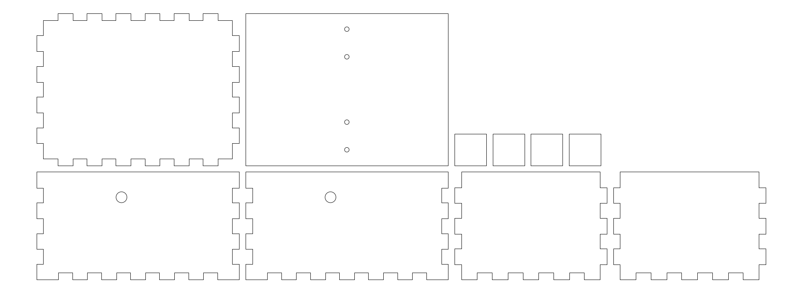
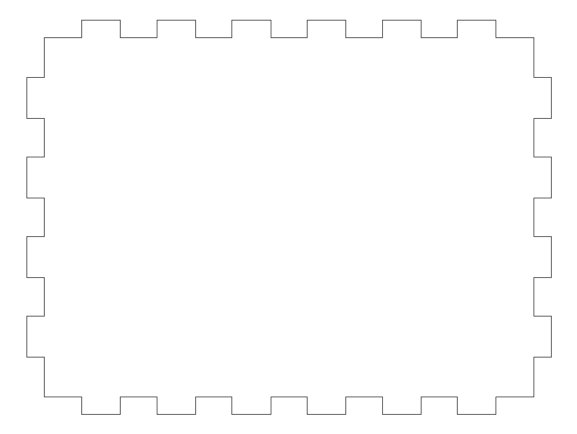
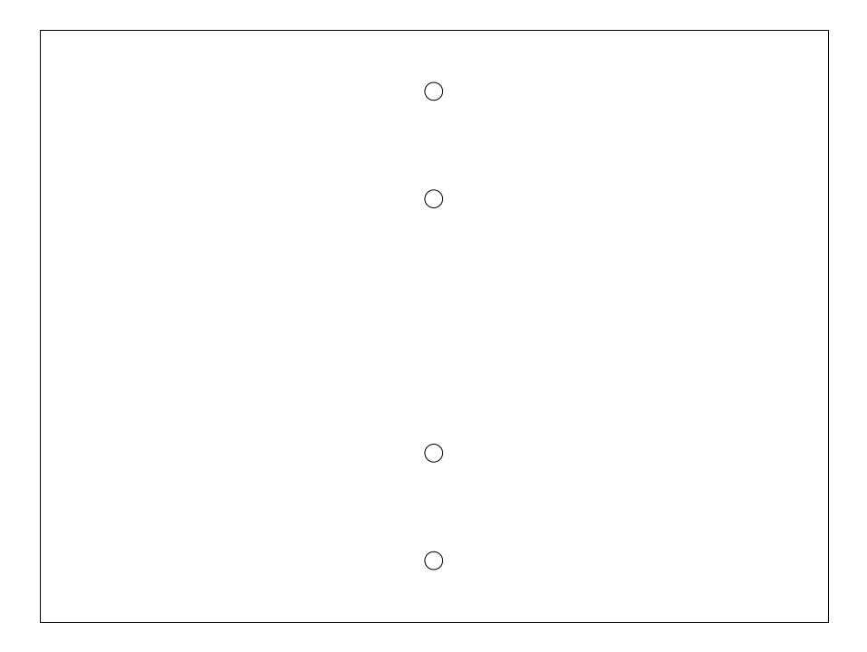
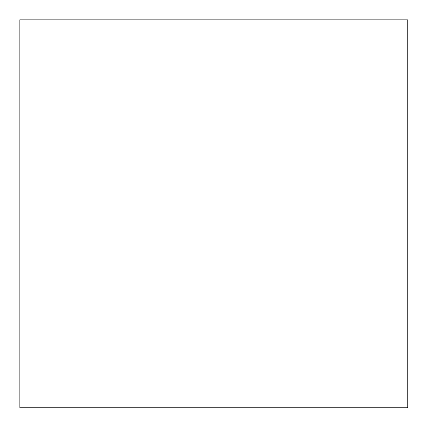
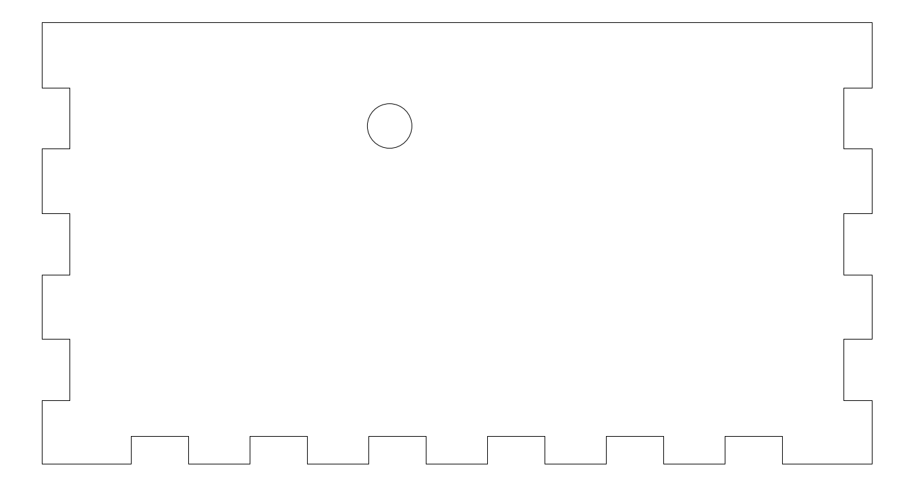
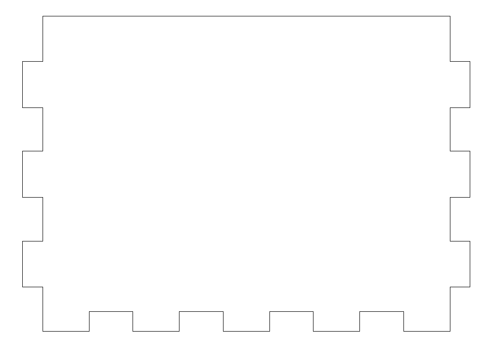
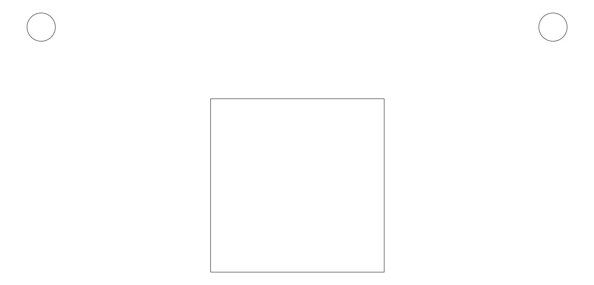
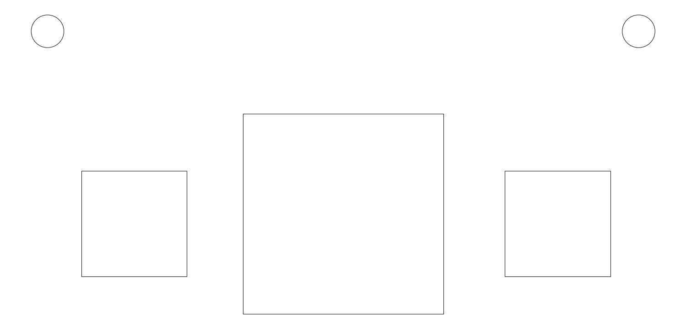
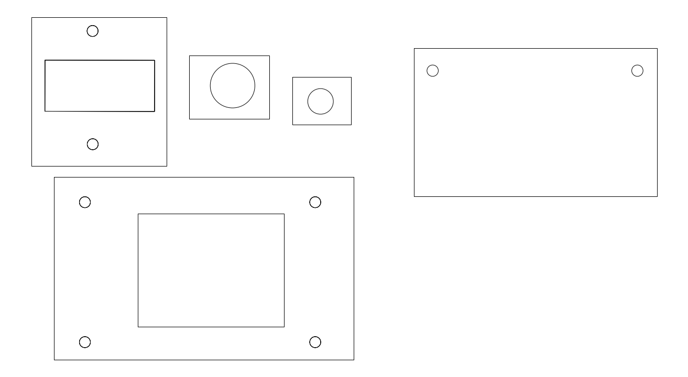

# micro:bit-Gehaeuse - Grundstruktur

Das Gesamt-Gehaeuse (Pappelsperrholz, lasergeschnitten), in das der micro:bit
und die einzelnen Hardware-Elemente eingebaut werden. Anders als die
Bauteil-Ordner unter [`../../input/`](../../input/), [`../../output/`](../../output/)
und [`../../servo/`](../../servo/) beschreibt dieser Ordner nicht ein
einzelnes Bauteil, sondern die Box drumherum.

> **Status: nicht verifiziert / in Arbeit.** Aus einem laufenden
> Fusion-Projekt exportiert. Vor der Fertigung pruefen, insbesondere
> Materialstaerke (aktuell fuer 5 mm Pappelsperrholz ausgelegt) und Kerf am
> eigenen Lasercutter.

## Aufbau

```
cad/
├── box-pappelsperrholz/   Aussenbox mit Fingerzinken (Boden, Deckelplatte,
│                          Eckklotz, Laengswand, Querwand + Gesamtzeichnung)
├── deckel-varianten/      Alternative Deckel-Ausschnitte fuer den micro:bit
├── microbit-halterung/    3D-druckbare Halterung, in die die micro:bit-
│                          Platine eingeklipst wird
└── schliessmechanismus/   3D-druckbare Teile fuer den Verschluss der Box
                           (Zahnstange, Ritzel, zwei Schalenhaelften)
```

## Box (Lasercutter, Pappelsperrholz)

Parameter aus dem Dateinamen der Fusion-Konstruktion: **t5** = 5 mm
Materialstaerke, **45°** Fingerzinken-Winkel, **k0.35** = 0.35 mm Kerf-Zugabe
pro Schnitt. Beim eigenen Lasercutter den Kerf am Testmaterial ermitteln und
bei Abweichung in Fusion neu exportieren statt die DXF von Hand
nachzuschneiden.

Schnitt-/Gravur-Layer-Werte fuer 6 mm Pappelsperrholz (Speed, Power, Fokus,
LightBurn-Kurzanleitung): [../../lasercutter-pappelsperrholz.md](../../lasercutter-pappelsperrholz.md).



| Datei | Vorschau |
|-------|----------|
| [`Boden.dxf`](cad/box-pappelsperrholz/Boden.dxf) |  |
| [`Deckelplatte.dxf`](cad/box-pappelsperrholz/Deckelplatte.dxf) |  |
| [`Eckklotz.dxf`](cad/box-pappelsperrholz/Eckklotz.dxf) |  |
| [`Laengswand.dxf`](cad/box-pappelsperrholz/Laengswand.dxf) |  |
| [`Querwand.dxf`](cad/box-pappelsperrholz/Querwand.dxf) |  |
| [`BOX_KOMPLETT.dxf`](cad/box-pappelsperrholz/BOX_KOMPLETT.dxf) | alle Teile oben auf einem Blatt |

## Deckel-Varianten (Download)

Drei Varianten fuer den Deckelausschnitt ueber dem micro:bit - je nach
gewuenschter Sichtbarkeit von LED-Matrix/Tastern auswaehlen:

| Datei | Vorschau |
|-------|----------|
| [`microbit_mit_Sichtfenster.dxf`](cad/deckel-varianten/microbit_mit_Sichtfenster.dxf) |  |
| [`microbit_mit_Sichtfenster_A_B.dxf`](cad/deckel-varianten/microbit_mit_Sichtfenster_A_B.dxf) - mit zusaetzlichem Ausschnitt fuer Taster A/B |  |
| [`microbit_ohne_Sichtfenster.dxf`](cad/deckel-varianten/microbit_ohne_Sichtfenster.dxf) |  |

## micro:bit-Halterung (3D-Druck, Download)

- [`cad/microbit-halterung/Microbit_V2_Case.stl`](cad/microbit-halterung/Microbit_V2_Case.stl) -
  Halterung fuer die micro:bit-V2-Platine, wird in die Box eingesetzt
  (auf GitHub direkt als 3D-Modell anschaubar, kein Download noetig).

## Schliessmechanismus (3D-Druck, Download)

Zahnstangen-Verschluss zum Auf-/Zuschieben der Box (alle als 3D-Modell direkt
auf GitHub anschaubar):

- [`cad/schliessmechanismus/Bolzen_Zahnstange.stl`](cad/schliessmechanismus/Bolzen_Zahnstange.stl)
- [`cad/schliessmechanismus/Ritzel.stl`](cad/schliessmechanismus/Ritzel.stl)
- [`cad/schliessmechanismus/Schale_oben.stl`](cad/schliessmechanismus/Schale_oben.stl)
- [`cad/schliessmechanismus/Schale_unten.stl`](cad/schliessmechanismus/Schale_unten.stl)

## Bilder

Fotos, Datenblatt-Ausschnitte, CAD-Screenshots in [`bilder/`](bilder/).
