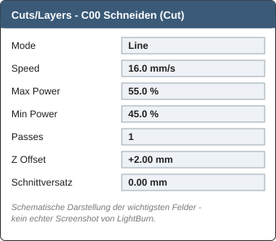
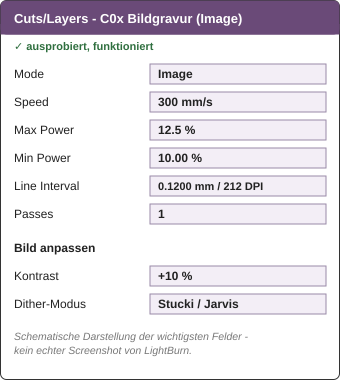

# Lasercutter: Pappelsperrholz 6 mm - Parameter & LightBurn-Kurzanleitung

Schnitt- und Gravurwerte fuer das Serienmaterial (Box + alle `cad/ausschnitt.dxf`
in diesem Repo), plus eine kurze LightBurn-Einfuehrung fuers Einstellen dieser
Werte. Gilt fuer die Maschine **Max-1060R, 100 W CO2** (Ruida-Controller,
LightBurn-Geraeteprofil `omtgech 1060r`, Arbeitsflaeche 1000 x 600 mm).

> **Sicherheit:** Lasercutter nur nach Einweisung und unter Aufsicht benutzen.
> Nur freigegebene Materialien verwenden, Laser waehrend des Betriebs nie
> unbeaufsichtigt lassen. **Nie ueber 80 % Max Power** (Roehrenlebensdauer),
> Kuehlwasser 18-22 °C, Maschine **nie ohne Kuehlung** betreiben. Keine
> Leistungswerte aus dem Internet uebernehmen - nur die hier freigegebenen
> Werte, Aenderungen nur nach Ruecksprache mit der Betreuungsperson.

## Material

**6 mm Pappelsperrholz** (Nennmass). Reales Blatt an 5 Stellen mit dem
Messschieber pruefen - der **groesste** gemessene Wert zaehlt fuer die
Konstruktion, nicht der Nennwert. Aktuell gemessen: **5.5 mm**. Weicht ein
neu gekauftes Blatt (andere Charge/Sorte) merklich ab, vor der Serie einen
kurzen Testschnitt mit den Werten unten machen, nicht blind uebernehmen.

## Bestaetigte Schnitt-Ebene (Cut)

| Parameter | Wert |
|---|---|
| Fokus | **+2 mm ins Material** (Z-Offset am Layer, nach Autofokus) |
| Geschwindigkeit | **16.5 mm/s** |
| Leistung | **Max 55 % / Min 45 %** |
| Durchgaenge | **1** |
| Kerf | **0.25 mm**, bereits **in der Geometrie** kompensiert (alle `ausschnitt.dxf` und die Box-Teile in diesem Repo) |
| LightBurn-Schnittversatz | **0 - nichts einstellen** (Kerf steckt schon in der Zeichnung, sonst wird doppelt kompensiert) |

**Status: verifiziert.** Cross-bestaetigt in mehreren realen LightBurn-Projekten
fuer diese Box (u. a. Zinken-Testteil: Teile liessen sich sauber herausdruecken).

## Gravur-Ebenen

| Modus | Einsatz | Geschwindigkeit | Leistung | Sonstiges | Status |
|---|---|---:|---|---|---|
| **Image** | Fotos, Graustufenbilder | 300 mm/s, 1 Durchgang | Max 12.5 % / Min 10 % | Line Interval 0.1200 mm (= 212 DPI) | **ausprobiert, funktioniert** |
| **Fill** | Text, Logos, Flaechen | 250 mm/s | Max 15 % / Min 10 % | Line Interval 0.1 mm | **nur Startwert, unbestaetigt** - erst testen |
| **Line** | Markierungen, Testbeschriftung | 150 mm/s | 12 % | - | **nur Startwert, unbestaetigt** |

Der 100-W-Laser braucht fuer Gravuren **deutlich** weniger Leistung als fuers
Schneiden - die hohe Maximalleistung der Maschine ist kein Grund, mit hoher
Leistung zu gravieren. Ist das Ergebnis zu hell: Geschwindigkeit und Leistung
vorsichtig in kleinen Schritten anpassen, immer erst am Reststueck testen.

### Image-Feineinstellungen (Fotogravur)

Zusaetzlich zu Speed/Power/Interval aus der Tabelle, im **Bild anpassen**-Dialog:

| Einstellung | Wert |
|---|---|
| Kontrast | **+10 %** |
| Dither-Modus | **Stucki** oder **Jarvis** |
| Min. Leistung | bleibt bei **10.00 %** - nicht mitziehen, wenn Max. Leistung angepasst wird |

Wird die Max. Leistung leicht erhoeht (z. B. von 12.5 % nach oben), wird nur
das Braun der dunkelsten Dither-Punkte etwas gesaettigter/dunkler - die
Min. Leistung bleibt davon unberuehrt bei 10.00 %. So lassen sich dunkle
Bereiche nachjustieren, ohne helle Bereiche zu veraendern.

---

Bedienung der Software (Ebenen einstellen, Datei importieren, Tastenkuerzel,
Fallstricke) und eine Tabelle **aller** Ausschnitt-/Halterungs-Dateien in
diesem Repo: [lightburn.md](lightburn.md).
